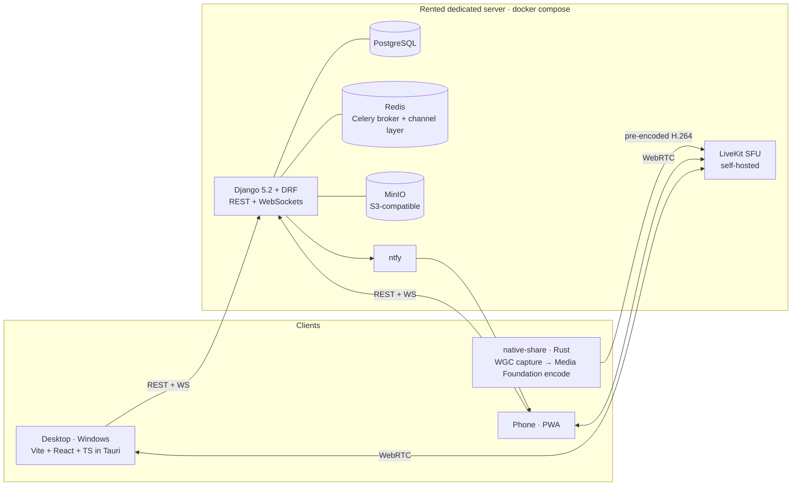

# HiveMind

> Architecture, engineering decisions and debugging write-ups for a self-hosted voice and 1440p60 screen-sharing platform I built and operate. Production code is private.

**Status:** in daily use since late July 2026 — first on a crew member's home
box, on a rented dedicated server since 2026-08-23.
**This repository documents the project. The production code is private** —
full code access on request during an application process.

The sibling repository [hivemind-mobile](https://github.com/R-u-d/hivemind-mobile)
is public and contains the four-week, two-developer MVP that preceded this work.

---

## The problem

Discord works until it doesn't. Three things broke down for this crew:

- **Screen-share quality.** The crew watches each other play at 1440p, and on a
  hosted platform that ceiling is somebody else's product decision — set for
  you, moved behind a subscription, and not reachable from your side. Owning the
  capture and encode path is what turns it into a number I can measure and
  raise. Both postmortems below are what that took.
- **Nothing is ours.** Channel structure, retention, bots, scheduling, presence —
  all rented, all subject to somebody else's roadmap.
- **Cost.** A hard constraint from the start: *nothing that charges*. No managed
  SFU, no cloud storage, no per-seat billing.

The target was concrete and falsifiable: **a 1440p60 screen share that several
people can watch at once, on mixed NVIDIA and AMD hardware, over German
consumer upstreams.** That one sentence is what the hard parts of this project
are about, and it is where both postmortems below come from.

## What it does

Voice and video cells, text channels and DMs, communities ("Hives"), events,
clips, a dashboard replacing the tab sprawl around a gaming session, and
integrations that were built because the crew actually asked for them — Steam
(library, wishlist, what you are playing), Spotify, YouTube watch parties, and
phone push over self-hosted ntfy.

The screen share is the feature the architecture is organised around. It does
not use the browser's `getDisplayMedia`: frames are captured and encoded
natively on the GPU and published pre-encoded. [ADR-0002](docs/adr/0002-native-capture-encode-path.md)
explains why that was necessary rather than clever.

**What it deliberately is not:** a general-purpose Discord clone. Every feature
is measured against one question — *will the crew actually stop using Discord
for this?*

## Architecture

| Layer | Choice |
|---|---|
| Desktop client | Vite + React 18 + TypeScript, Zustand, packaged with Tauri. Windows installer only. |
| Native capture / encode | Rust crate: Windows Graphics Capture → `ID3D11VideoProcessor` → Media Foundation H.264, one D3D11 device, no CPU round trip |
| Phone | PWA, not a second app — see [ADR-0003](docs/adr/0003-pwa-instead-of-tauri-mobile.md) |
| Backend | Django 5.2 + DRF, PostgreSQL, Redis (Celery + WebSocket channel layer) |
| Real-time media | Self-hosted LiveKit SFU — see [ADR-0001](docs/adr/0001-self-hosted-livekit.md) |
| Storage | MinIO, S3-compatible, self-hosted |
| Push | ntfy, self-hosted |
| Hosting | One rented dedicated server, `docker compose`, Caddy for TLS — see [ADR-0004](docs/adr/0004-rented-root-server.md) |

More detail: [docs/architecture.md](docs/architecture.md) ·
[docs/deployment.md](docs/deployment.md)

## Decisions

Every non-obvious choice that was genuinely deliberated is written up as an
[ADR](docs/adr/). The short version:

| Decision | Chosen | Alternative | Why |
|---|---|---|---|
| Real-time media | Self-hosted LiveKit | LiveKit Cloud | Free tier covers ~4 gaming evenings a month, then bills |
| Screen share path | Native Rust capture + Media Foundation | Browser `getDisplayMedia` | Chromium would not hand the track to a hardware encoder — measured, not assumed |
| Phone client | PWA | Tauri mobile target | Half the app is desktop-only Rust; an iOS build needs a paid developer account |
| Hosting | Rented dedicated server | Friend's home box | Fan-out is one stream copy per viewer; the home uplink was the wall |

## What went wrong, and what I did about it

Two write-ups, both reconstructed from the measurement log kept while the bugs
were open. Neither is a highlight reel — the point of both is the order in which
wrong answers were eliminated.

- **[Why the screen share would not go above 60 fps](docs/postmortems/01-screenshare-frame-rate.md)**
  Six separate faults, found in the wrong order, none of them the thing
  originally suspected — plus a seventh that later turned out to be an artefact
  of my own readout, which is written up rather than quietly removed. The one
  that mattered most was a capture-API parameter I set myself, and the one that
  ended the hunt was a Windows display setting no amount of reading my own code
  could have revealed. Includes the two rules that came out of it.
- **[Why the screen share only worked on current NVIDIA cards](docs/postmortems/02-gpu-vendor-failures.md)**
  Black screens and frozen streams on AMD, and on an older NVIDIA card that
  never produced a diagnostic dump. Four root causes, two closed on hardware and
  two with a shipped fix nobody has been able to measure yet — stated as such.
  Two of the four were specification violations that one vendor's driver forgave
  and the other did not.

## How this was built

Four years as an SAP / IT consultant before this — requirements, S/4HANA
migration projects, test management. That is where the habits in these documents
come from: the measurement log, the hypothesis table with a verdict per row, the
discipline of writing down the theory that turned out to be wrong.

Implementation is AI-assisted, and that is not hidden here. What I contribute is
the part that cannot be delegated: deciding what to build, choosing between
architectures, designing the instrument that will settle an argument, and judging
whether the result actually holds up for the eight people it was built for.
The ADRs and the postmortems in this repository *are* that work, written down —
they are not a description of it.

A note on what this means in practice: in both postmortems, the AI-assisted part
produced several confident, plausible, wrong explanations. What closed the bugs
was insisting on a measurement before each fix, and noticing that a row of
consecutive fixes had each improved a number without touching the complaint.
One of those explanations survived long enough to get shipped and had to be
withdrawn later, when a better instrument showed the deficit it corrected had
never existed.

## Scale

| | |
|---|---|
| Desktop repository | 941 commits, 153 tagged releases, 2026-07-18 → 2.65.0 on 2026-09-07 |
| Process | branch → squash-merged PR into `develop` → tagged release. 262 merged PRs against 100 issues: the larger threads got an issue, most single-purpose branches did not. `develop` is the trunk — `main` is a stale release pointer, 14 of the 153 tags. |
| CI | per PR: typecheck, lint, unit tests, production build and Playwright E2E for the frontend; `ruff` and `pytest` for the backend |
| Tests | 208 frontend test files, 113 backend, 26 Playwright E2E specs, 144 Rust unit tests (64 `src-tauri`, 80 `native-share`) |
| Backend domains | 16 Django apps — chat, communities, events, clips, feed, friends, guides, notifications, deals, watchparty, remoteplay, updates, ai, spotify, youtube, users |
