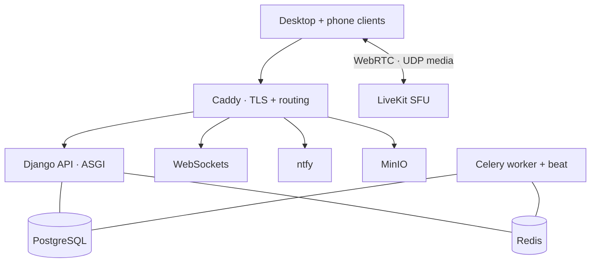

# Deployment

> Sanitised. No hostnames, IP addresses, ports or credentials appear in this
> repository.

## Topology

One rented dedicated server. Everything above is one `docker compose` stack on
it, except that the SFU's media ports are published directly rather than
proxied — an SFU's UDP media cannot be NAT'd through a reverse proxy.

## Operations

| Topic | Approach |
|---|---|
| Provisioning | Ubuntu LTS, Docker, one compose file. Written up as a runbook that assumes no prior server administration — every command copy-pasteable. |
| TLS | Caddy, automatic certificates |
| Storage | MinIO, S3-compatible, addressed through the same presigned-URL code path that would talk to S3. Not quite free: the S3 client had no endpoint override, so pointing it at MinIO was a ~3-line change plus the endpoint and credential variables |
| Backups | Scheduled database and object-storage dumps, as a container in the stack. Restored for real during the 2026-08-23 move — **both halves, always**: restore the database without the object store and every avatar and attachment 404s, and reuse the same secret key or every existing login is invalidated |
| Updates | Self-hosted update feed; the client checks an API endpoint rather than a third-party release host |
| Monitoring | Container logs, plus the SFU's own statistics — which turned out to be the best instrument in the project, see [ADR-0001](adr/0001-self-hosted-livekit.md) |
| Deploy | Pull and `docker compose up -d` on the box; the desktop installer is built in CI and signed with the updater's own key, so the update feed can verify it. Not Authenticode — a code-signing certificate is a recurring cost, so Windows SmartScreen warns on first install. |

## Why a rented server rather than managed cloud

The full argument is [ADR-0004](adr/0004-rented-root-server.md). In one line:
the SFU sends one copy of a screen share per viewer, so four viewers of a 1440p
share is ~62 Mbps of egress — which is metered spend in a managed cloud, and was
more than the home connection it originally ran on could produce.

## Operational history

Three things were built, run, and then deliberately removed. They are recorded
because a decision log that only contains surviving decisions is not a log.

| Thing | Why it existed | Why it went |
|---|---|---|
| An embedded VPN mesh (Tailscale, bundled with the client) | To reach a backend behind a consumer router, without asking each crew member to set up a tailnet by hand | The rented server has a real public IPv4. The whole mechanism became dead weight. |
| A third-party release feed for client updates | The conventional way to ship desktop updates | Replaced by a self-hosted update endpoint — one less external dependency, and consistent with the rest |
| macOS and Linux desktop builds | Started as a cross-platform app | The screen share is structurally Windows-only, so the other two were shipping a build without the product's main feature |

Two earlier hosts preceded the current one: a Mac, then a crew member's Linux
box. Both worked. The first was abandoned because Docker on macOS cannot NAT an
SFU's UDP media, so the SFU had to run outside the stack; the second because of
the uplink arithmetic in ADR-0004.
